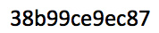

The Oracle of Bacon
===================

The goals of this assignment are as follows:

1. Give you more exposure to RSpec and to more advanced and idiomatic
Ruby programming

2. Introduce you to important technologies and libraries used in
service-oriented architecture, including parsing XML using XPath
expressions and calling RESTful APIs of a remote service

3. Get you accustomed to reading both RSpec code and Ruby app code.

Generally useful documentation pointers, in addition to those specific
to this assignment scattered throughout the handout:

Nokogiri docs: http://nokogiri.org/

Docs for Ruby libraries Net::HTTP, URI, CGI:  http://ruby-doc.org/stdlib-1.9.3

# Background: The Oracle of Bacon

The [Oracle of Bacon](http://oracleofbacon.org) is a fanciful website
maintained by Berkeley alumnus Patrick Reynolds.  You enter the names of
two actors (if you leave either one blank, it defaults to Kevin Bacon)
and it computes the number of links or degrees of separation ("Bacon
number") between the two actors, using information from the Internet
Movie Database (IMDb).  A "link" is a movie that two actors have worked
on together.  For example, Sir Laurence Olivier has a Bacon number of 2:

     Laurence Olivier \_ Dracula (1979)
                      /
      Frank Langella  \_ Frost/Nixon (2008)
                      /         
          Kevin Bacon    

You can read this as: "Laurence Olivier starred in Dracula with
Frank Langella; Frank Langella starred in Frost/Nixon with Kevin
Bacon."

The website also has a RESTful XML API that returns raw XML documents
rather than complete Web pages.  We will use this API in this
assignment.  

We've provided a code skeleton and a reasonable (but not exhaustive) set
of specs for this assignment.  The assignment has 4 parts; each part has
its own specs in a `describe` group.  Initially, all specs are marked
`:pending => true` so you don't get a rash of failing tests when you
start the assignment; when you start work on any one part of the
assignment, remove the pending option from the describe block, watch the
group of tests fail, and then start writing the code to make them pass.
(This is a crude version of the Test-Driven Development methodology we
embrace later in the course; in the full version of TDD, you will write
your own tests one at a time, watching each one fail and then creating
the code to make it pass.)

# Part 0: Background (no submission needed)

You can experiment with the XML API at [this test
page](http://oracleofbacon.org/xmltest.html), but you will need to
provide an API key.  The key provided for using the API in this course
is in the picture below, to avoid having it indexed by search engines:

*Please respect the Oracle's maintainers by not using this key for any
purpose other than doing this assignment.*

A minimal RESTful query URI for OOB must include the API key (parameter
`p`), the actor from which to start search (parameter `a`), and
optionally the actor to connect to (optional parameter `b`; defaults to
Kevin Bacon if omitted).  If there is more than one way to
connect two actors together, the Oracle of Bacon returns one chosen
randomly, so the responses you get may differ from those in this handout.

Remember that special characters in URIs must be
escaped and that one such special character is a space, which may be
replaced by `+` in a URI.  Thus valid queries might be (if you
replace `my_key` with the valid API key above):

    http://oracleofbacon.org/cgi-bin/xml?p=my_key&a=Kevin+Bacon&b=Laurence+Olivier

which connects Laurence Olivier with Kevin Bacon, or

    http://oracleofbacon.org/cgi-bin/xml?p=my_key&a=Carrie+Fisher&b=Ian+McKellen

which connects Carrie Fisher with Ian McKellen.

* Visually inspect the XML returned for each of the above queries.  You
can view it by typing the URIs into a browser, or better, by using a
command-line tool such as `curl`.   What kinds of XML elements are
present in the response?  What is their hierarchical structure?

If there are multiple matches for an actor name, you'll get a list of
similar names so you can resubmit your query with an exact match.  For
example, try doing a query connecting Anthony Perkins to anyone.

* Visually inspect the XML returned.  How are the element types
different from those for a normal response?

Finally, if you submit a request whose URI does not include a valid API
key, you'll get a third type of response, informing you that the access
was unauthorized.

* Visually inspect the XML returned.  How does it differ from the
previous two responses?

In the rest of this assignment you'll create a Ruby wrapper library to
make it easier to use the Oracle of Bacon.  With our new library, we'd
be able to run the above three examples as follows (again replacing
`my_api_key` with the valid key given previously).  

    oob = OracleOfBacon.new('my_api_key')

    # connect Laurence Olivier to Kevin Bacon
    oob.from = 'Laurence Olivier'
    oob.find_connections
    oob.response.type      # => :graph
    oob.response.data      # => ['Kevin Bacon', 'The Big Picture (1989)', 'Eddie Albert (I)', 'Carrie (1952)', 'Laurence Olivier']

    # connect Carrie Fisher to Ian McKellen
    oob.from = 'Carrie Fisher'
    oob.to = 'Ian McKellen'
    oob.find_connections
    oob.response.data      # => ['Ian McKellen', 'Doogal (2006)', ...etc]

    # with multiple matches
    oob.to = 'Anthony Perkins'
    oob.find_connections
    oob.response.type      # => :spellcheck
    oob.response.data      # => ['Anthony Perkins (I)', ...33 more variations of the name]
    # with bad key
    oob = OracleOfBacon.new('known_bad_key')
    oob.find_connections
    oob.response.type      # => :error
    oob.response.data      # => 'Unauthorized access'

# Part 1: Valid instance object

Before even attempting to find connections, an OracleOfBacon object must
have at least one of `from` or `to` specified (if one is missing, it's
assumed to be Kevin Bacon), and a nonblank API key (although we won't be
able to tell if it's valid until we try hitting the service).

We use the `ActiveModel::Validations` module that is part of Rails to
streamline our validity checks.  It is a module that mixes in
validity-checking methods for object attributes and gives our object
an instance method `valid?` that checks all the constraints and returns
true or false.
We've included validity checks for the
presence of non-blank From, To, and APIKey attributes in an
OracleOfBacon instance.  

1. In the root directory of this homework (the one containing `lib` and
`spec` subdirectories), start `autotest`.  It will look for tests in
`spec` and for your code in `lib/oracle_of_bacon.rb`.  If `autotest`
appears to do nothing: Check that you are running it in the code's root
directory (the one that has `lib` and `spec` as subdirectories) and that
the `.rspec` file exists in this root directory.

2. Delete `,:pending => true` from the `describe 'instance'` block,
which should immediately cause that set of tests to fail red.
Visually inspect the failing specs to get a feel for how they are written.
Don't worry if you don't understand everything that's going on; the goal
is to get you accustomed to reading code and seeing common idioms.

3. Define the constructor for OracleOfBacon so that both From and To
initially default to Kevin Bacon, rather than being blank.  This should
cause a subset of the validity specs to pass green.

4. Since it makes no sense to connect an actor to herself, we should
also validate that the From and To fields aren't the same.  `validate`
takes a symbol naming a method that can perform a desired validation.
Fill in the method `from_does_not_equal_to` to perform this validation.
Note: you'll have to check the documentation for `ActiveModel::Validation` 
and `ActiveModel::Errors` at [api.rubyonrails.org](http://api.rubyonrails.org)
to learn how to record your own error message "From cannot be the same
as To", which the spec (test) expects to be generated in this case.

When you've done the above steps correctly, all the specs in
`describe 'instance'` should pass green.

# Part 2: Parsing XML responses

We define a separate class, `OracleOfBacon::Response`, to hold a
response from the service.  This class exposes the `type` and `data`
attributes to the caller, as the examples above showed.  "Nesting" one
class definition inside another is often done when 
the nested class (`Response`) is rarely used separately from the
enclosing class (`OracleOfBacon`).

In our case, successful response to OOB queries return XML markup, which
we will parse using the [Nokogiri library](http://nokogiri.org).  As we
saw above, there are three response types (graph, spellcheck, error),
but we'll use the same techniques on all three. 

Although Nokogiri is hugely powerful, there are just two Nokogiri calls
you need to know to parse this simple  example.

1.  The constructor `Nokogiri::XML` takes a string (or, as is idiomatic
Ruby, an open file descriptor or stream descriptor), parses its contents
as XML, and returns a `Nokogiri::XML::Document` representing the parsed
tree.

2.  The instance method `#xpath` on a Nokogiri XML document or node
returns a collection of all nodes in that subtree matching the given
XPath selector.  Just as CSS selectors identify particular elements in
an HTML document, XPath  is an amazingly powerful syntax for identifying
collections of elements in an 
XML document.  Some mastery of XPath is a valuable tool in any SaaS
developer's toolbox, but we will restrict ourselves to two very simple
XPath expressions:

    /foo    Matches an element <foo>...</foo> at the *root* of this subtree
    //foo   Matches an element <foo>...</foo> *anywhere in* this subtree

Hence, the XPath expression `/error` applied to an error response
matches the outermost `<error>` element (which, 
remember, includes all of its child elements); `/link` applied to a successful
response matches the enclosing `<link>` element;
and `//actor` applied to a successful response returns a collection
(quacks like an `Array`) of *all* the `<actor>` elements at or below
the document's root.

(If you want to experiment interactively with XPath to learn more about
it, [the XPathTester site](http://www.xpathtester.com/) lets you paste
a blob of XML and try various XPath expressions on it to see which
elements are returned.)

Point #1 above -- a constructor that makes a new object (XML document)
from an existing object of a different type (string) -- is a very common
Ruby idiom.  We follow it by requiring the constructor for
`OracleOfBacon::Response` to accept a blob of XML (returned by the OOB
server) and turn it into an internal Response object.  The conversion
involves (a) determining what type of response it is (regular graph,
spell check, error) and (b) parsing the XML data depending on the
response type.

We've started you off with a constructor that handles the error case.
You need to handle the other two.  Read the specs under `describe
'parsing XML response'` and match them up with the requirements below:

* For a normal graph, the `data`
attribute of the `Response` object should be an array that alternates
actor names and movie names, as the code block example above showed, and
the `type` value should be `:graph`.

* For a spell check, the `data` should be a simple array of all the
possible spelling variants and `type` should be `:spellcheck`.

* For readability, we suggest you define `parse_graph_response` and
`parse_spellcheck_response` methods and call them as needed from the
constructor.  

* You should also handle a response that doesn't match any of the three
types, by giving it a response type of `:unknown` and a data field
consisting of the string `unknown response type`.

When you complete the above four steps, all the specs in `describe
'parsing XML response'` should pass green.

*Helpful hints* for parsing XML and converting node text into arrays: 

* The `text` method on a `Nokogiri::XML::Node` returns the actual text
content of that node.  That is, if `node == <actor>Carrie
Fisher</actor>`, then `node.text == "Carrie Fisher"`.

* `zip` interleaves the element of its receiver with those of its
argument, using `nil` to pad if the first array is longer than the
second; that is, `[:a,:b,:c].zip([1,2])==[[:a,1],[:b,2],[:c,nil]]`

* `flatten` takes an array that includes arbitrarily nested arrays and
flattens them into a single array with no nested arrays, that is,
`[[:a,1],[:b,2],[:c,nil]].flatten==[:a,1,:b,2,:c,nil]` 

* `compact` removes nil elements from a collection, that is,
`[:a,1,:c,nil].compact==[:a,1,:c]`

Questions for self-reflection:

* Our Response object manipulates an internal variable `@doc`.  Why
didn't we expose it with `attr_reader :doc`?

* What does the keyword `private` do (right after the constructor) and
why did we use it here?

(Hint: Both questions concern matters of style and modularity, *not*
correctness.  That is, the code would work either way.)

# Part 3. Constructing the URI

We know what the URI has to look like, but the URI rules (warning: they
are [boring to read](http://tools.ietf.org/html/rfc3986)) stipulate that
special characters in URIs such as # or spaces must be 'escaped'.
Happily, Ruby's standard library provides `CGI.escape(string)` to help
us do this.

* Fill in the method `make_uri_from_arguments` that uses the `@from`,
`@to`, and `@api_key` attributes of an `OracleOfBacon` instance and
assigns a properly-escaped URI to the `@uri` attribute.  
The specs verify that the URI contains
no illegal characters and that it contains all the components in the
arguments. 

At the end of this part, the specs under `describe 'constructing URI'`
should pass green.

# Part 4: Connecting to the service

And now the moment we've all been waiting for:  *connecting to the
actual Oracle Of Bacon service!!!*

Except we're not going to do that.  Given that you're re-running tests
every time you change the code, it would be inconsiderate (and for some
sites, in violation of the terms of use of the API key) to hit the site
every time you do so.  Instead, we will use FakeWeb, which we'll learn
more about later in the course, to fake a "canned" response by
intercepting calls to Ruby's `Net::HTTP` library.

(Of course, this is only true when running tests.  Your real code will
really talk to OOB.)

Since we've already tested that the various types of XML responses are
handled properly by the constructor of `OracleOfBacon::Response`, all we
are testing here is the service connection itself, in
`find_connections`.
If successful, it should try to hand off the received blob of XML to the
constructor for `Response`.  If there's a network problem--
unfortunately, Ruby's HTTP library can raise many kinds of exceptions--
we convert any of them into a generic `OracleOfBacon::NetworkError` and
re-raise that.  

* Modify `find_connections` to handle both the successful response case
and the network exception case.  This should cause the specs under
`describe 'service connection'` to pass.

Question for reflection:

* As we'll learn later in the course, the .xml files under `spec` that
contain the "canned" responses are sometimes called *fixtures*.  How
would you create these yourself when you're developing tests for your
own RESTful service library?  (Hint: the command-line utility `curl` may
be useful.)

# You're done! 

Believe it or not, you're done.  You can try firing up an `irb`
interpreter and exercising the library by saying `load
oracle_of_bacon.rb` and trying the examples in the code block in the
Background section of this handout!

For fun, you can add a `draw_graph` method that does the following: if
the result type is `:graph`, it draws something like this using ASCII
characters ---

     Actor 1 \_ Movie 1
             /
     Actor 2 \_ Movie 2
             /         
     Actor 3 

---and if the result type is anything else (including `nil` when there
is no result yet), it prints an error.

